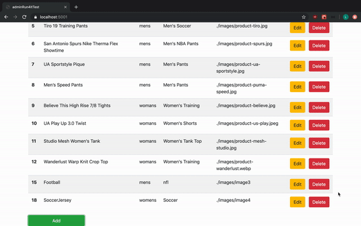
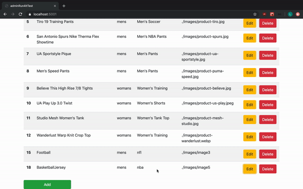
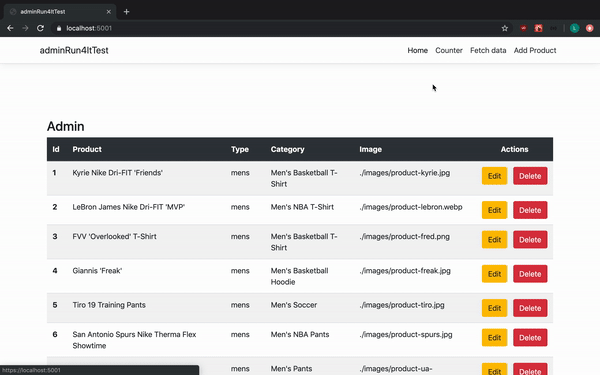

# Admin Page(Run4It)
This project is an admin page for the eCommerce website (Run4It). This page allows the admin to utilize the CRUD methods for any product.

## Demo
Below is a demo of the admin page utilizing CRUD methods.

### Create

### Update

### DELETE

### Read

### Built With

* [React](https://reactjs.org/docs/getting-started.html) - JavaScript library for building user interfaces
* [C#](https://docs.microsoft.com/en-us/dotnet/csharp/) - An elegant and type-safe object-oriented language that enables developers to build a variety of secure and robust applications that run on the .NET Framework.
* [MySQL](https://dev.mysql.com/doc/) - Relational database management system

## Author
* [Lovepreet Thind](https://github.com/Thind-Lovepreet14)

## License

This project is licensed under the MIT License - see the [LICENSE.md](LICENSE.md) file for details
